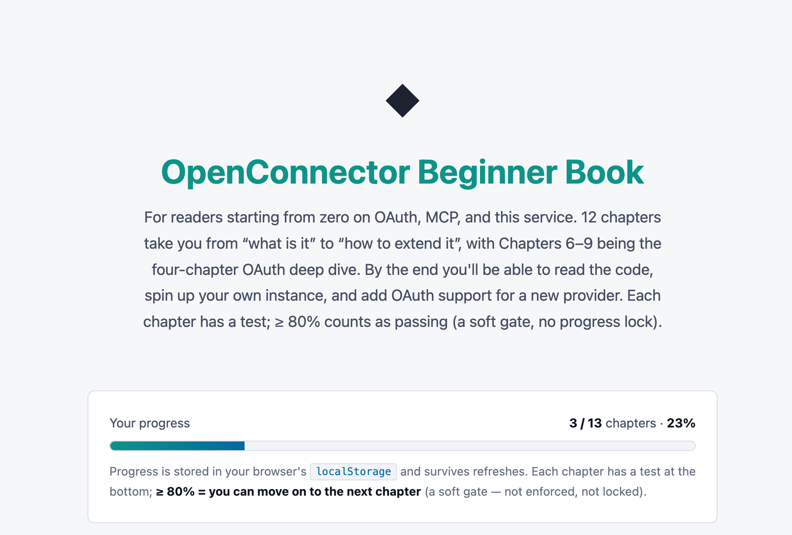
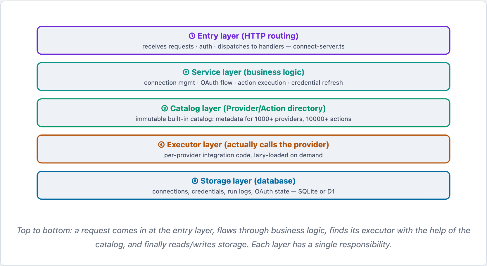
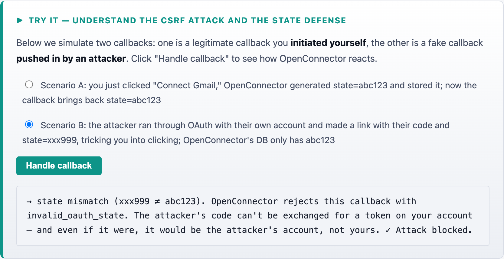
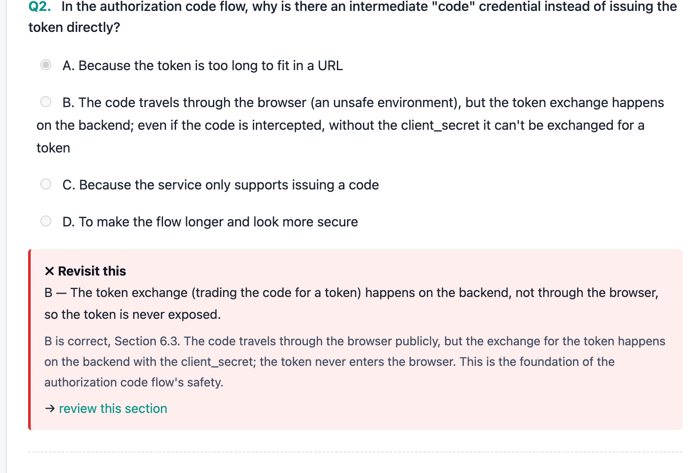
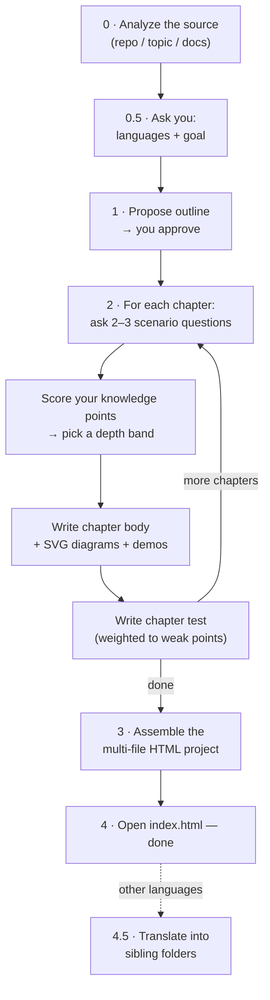

<div align="center">

# 📖 Personal Book Forger

**A ZCode agent skill that forges a personalized, interactive HTML textbook from any repo, topic, or document pile — written at the depth *you* actually need.**

[](https://github.com/JJack27/personal-book-forger)
[](#-what-you-get)
[](#-what-you-get)
[](#-what-you-get)
[](#-multi-language-books)

<!-- 📸 HERO SCREENSHOT: replace assets/screenshots/hero.png with your best shot
     (the dashboard, or a side-by-side montage of dashboard + chapter + diagram) -->


*Every chapter starts with a short diagnostic: the skill asks you 2–3 real scenario questions, scores what you actually know, and calibrates the chapter accordingly — skimming what you've mastered, teaching fully what you don't.*

</div>

---

## 🎯 Why this exists

Ask an AI to teach you something and you usually get a generic essay that starts from zero — re-explaining what you already know, and glossing over what you don't.

**Personal Book Forger flips the direction.** Before writing each chapter it interrogates *you*:

> *"Here's a snippet using `RefCell` — what does it print, and why?"*

Your answer decides the depth. If you clearly already fight the borrow checker daily, the chapter skips "what is ownership" and goes straight to lifetimes, variance, and the pitfalls that bite in practice. Every chapter ends with a test; hit **80%** and it's marked learned — miss it, and each wrong question links back to the exact section to re-read.

The result is a real **book you own**: static HTML files on your disk, no server, no account, no build step.

## ✨ Features

| | |
|---|---|
| 🎯 **Adaptive depth** | 2–3 scenario/code questions before *every* chapter → skim / targeted / full |
| 📚 **Any source** | a local **repo**, a domain **topic**, **docs & papers** (URLs or files) — or any mix |
| 🧭 **Two goals** | `domain-expert` — master a field · `repo-expert` — onboard onto a codebase (architecture, DB schema, core services, data flow, API surface, contributing map — auto-detected from what the repo actually has) |
| 📄 **Self-contained HTML** | one `.html` file per chapter + an `index.html` dashboard. No server, no build, no internet — works straight from `file://` |
| ✏️ **Inline SVG diagrams** | ER sketches, flow diagrams, architecture maps — drawn, not described. Pure SVG, still works offline |
| 🕹️ **Interactive demos** | small per-book widgets (a hash-stability demo, a token slider, a step-by-step loop printer) |
| 🧠 **Knowledge graph** *(optional)* | concept map on the dashboard — progress view lights concepts as you pass chapter tests, full view shows the end-state map; click a node to deep-link to the chapters & sections that teach it. Cytoscape.js CDN renderer with an automatic offline fallback |
| ✅ **Chapter tests** | mixed multiple-choice (single + multi), fill-in/code-fill, and short-answer with self-check |
| 🔁 **80% soft gate** | fail nothing is locked — wrong answers highlight and link to the exact section to re-read |
| 🌍 **Multi-language** | `en/`, `zh/`, `ja/`… parallel sibling folders; switch language with a single link, no runtime switcher |
| 💾 **Progress tracking** | scores and chapter status persist in `localStorage`, per book *and* per language |

## 📸 Screenshots

> 📷 **Placeholders** — drop your screenshots into `assets/screenshots/` with these filenames and they'll appear here automatically. See [`assets/screenshots/README.md`](assets/screenshots/README.md) for exactly what to capture.

<table>
  <tr>
    <td width="50%" align="center">
      
      <br><sub><b>The dashboard</b> — chapter list with per-chapter status (✓ pass · • below 80% · ○ not taken) and overall progress.</sub>
    </td>
    <td width="50%" align="center">
      
      <br><sub><b>A chapter</b> — dark-cyan theme, learning objectives, and inline SVG diagrams for structure and flow.</sub>
    </td>
  </tr>
  <tr>
    <td width="50%" align="center">
      
      <br><sub><b>Interactive demos</b> — run a concept in motion: sliders, step-throughs, live output.</sub>
    </td>
    <td width="50%" align="center">
      
      <br><sub><b>Test feedback</b> — wrong answers highlighted, each with a "review this section" link to the exact anchor.</sub>
    </td>
  </tr>
</table>

## 🚀 Quick start

**1. Install the skill** (it's discovered from `~/.agents/skills/`):

```bash
git clone https://github.com/JJack27/personal-book-forger
cp -r personal-book-forger ~/.agents/skills/
```

**2. Just talk to your agent.** The skill triggers on natural requests — no command to memorize:

> *Make me a book on Rust ownership and borrowing. I've written some Rust but I keep fighting the borrow checker.*

Then answer three things as it works — **which languages**, **which goal** (domain or repo expert), and **approve the outline**. After that it forges chapter by chapter, calibrating depth as it goes. When it's done:

```bash
open books/<your-book>/en/index.html   # or just double-click it — that's the whole runtime
```

<details>
<summary><b>💬 More example prompts</b></summary>

| Source | Goal | Prompt |
|---|---|---|
| Topic | domain-expert | *"Create a course for me on database indexes. English primary, but I also want Japanese and Spanish versions."* |
| Repo | repo-expert | *"Onboard me to this codebase at `~/projects/some-repo`. I want to actually become an expert on it — DB, services, the works. English and Chinese."* |
| Papers | domain-expert | *"Build me a study guide on distributed consensus from these two papers: \<url1\>, \<url2\>. I know basic distributed systems but Paxos/Raft always confuse me. Chinese."* |
| Any | any | *"Turn this repo into something I can learn from"* · *"onboard me to this codebase"* · *"build me a study guide for Z from these docs"* |

</details>

## 🧠 How it works

The calibration loop is the whole point — no chapter is written before the skill knows what you know:



| Your answers say… | The chapter… |
|---|---|
| all points already mastered | **skim + advanced** — a short recap, then straight to edge cases and pitfalls |
| mixed mastery | **targeted** — recap what you know, teach the weak points in full |
| nothing | **full** — foundations up, complete treatment |

For `repo-expert` books the skill reads the **actual code**, not just the README — and explicitly flags anywhere the docs promise more than the implementation delivers, then probes that gap in the test.

## 📦 What you get

A folder of static HTML — yours to keep, host, or zip up and share:

```
books/your-book/
├── en/                        # one folder per language (en is primary here)
│   ├── index.html             # dashboard: TOC, progress, chapter descriptions
│   ├── 01-foundations.html    # one self-contained .html per chapter
│   ├── 02-core-mechanisms.html
│   ├── …
│   └── assets/
│       ├── style.css          # dark-cyan theme (shared across languages)
│       └── book.js            # scoring + nav + demos registry (shared)
└── zh/                        # sibling folder: same structure, same anchors,
                               # translated prose — language switch is a link
```

- **Everything works under `file://`** — no server, no build step, no internet, no dependencies.
- **Tests are fully client-side** — scored in the browser from `data-*` attributes, results in `localStorage`.
- **Regenerable** — come back to the agent anytime to add, revise, or deepen chapters.

## 🌍 Multi-language books

Pick any set of languages up front. The first (your chat language by default) is authored end-to-end; each additional one becomes a **sibling folder** — an independent, complete copy with the same section ids, same question counts, same answers for code-symbol questions. Switching language is a hyperlink to the parallel page, so the book stays 100% static. Progress is tracked *per language*.

## ❓ FAQ

<details>
<summary><b>Do I need a server, a build step, or an internet connection?</b></summary>

No. Every chapter is a fully self-contained HTML file that works opened directly via `file://`. The whole book is a folder you can keep anywhere.
</details>

<details>
<summary><b>What can it build a book from?</b></summary>

Three sources, in any combination: a **local repository** (it reads the README, the tree, key entry points, and recent commits), a **topic/domain** (it follows the field's standard conceptual progression), or **external materials** — docs, tutorials, papers as URLs or files. With multiple sources, the topic is the skeleton and the repo/materials supply worked examples — unless the goal is `repo-expert`, where the repo's own structure drives the outline.
</details>

<details>
<summary><b>What happens if I fail a chapter test?</b></summary>

Nothing locks — the 80% gate is deliberately soft. The chapter is marked "below 80%" on the dashboard, every wrong question is highlighted with a link to the exact section to re-read, and you can retake anytime.
</details>

<details>
<summary><b>Which agents can use this skill?</b></summary>

It's a ZCode skill in the open agent-skills format — a `SKILL.md` plus reference docs. Any agent that loads skills from `~/.agents/skills/` can run it.
</details>

<details>
<summary><b>Can it write the book in Chinese / Japanese / Spanish / …?</b></summary>

Yes. Ask in the language you want, or name several — e.g. "English primary, plus Chinese and Japanese." Each language gets its own complete sibling folder.
</details>

<details>
<summary><b>I just want the whole book generated without the questions.</b></summary>

Say so — it will honor it (with a one-time warning that depth calibration will be coarse) and default every chapter to medium depth.
</details>

## 📁 Repository layout

```
personal-book-forger/
├── SKILL.md                       # the workflow — the skill's entry point
├── references/
│   ├── source-analysis.md         # extracting structure from repo/topic/materials
│   ├── assessment-questions.md    # writing & reading the per-chapter diagnostics
│   ├── test-design.md             # test size, question types, the 80% rule
│   ├── project-structure.md       # HTML layout, data-* schemas, SVG & demos
│   └── i18n.md                    # sibling-folder convention & translation rules
└── assets/
    ├── book-template/             # the template project each book starts from
    └── screenshots/               # README screenshots
```

---

<div align="center">

**Forged books, not generated essays.** 📖🔥

</div>
