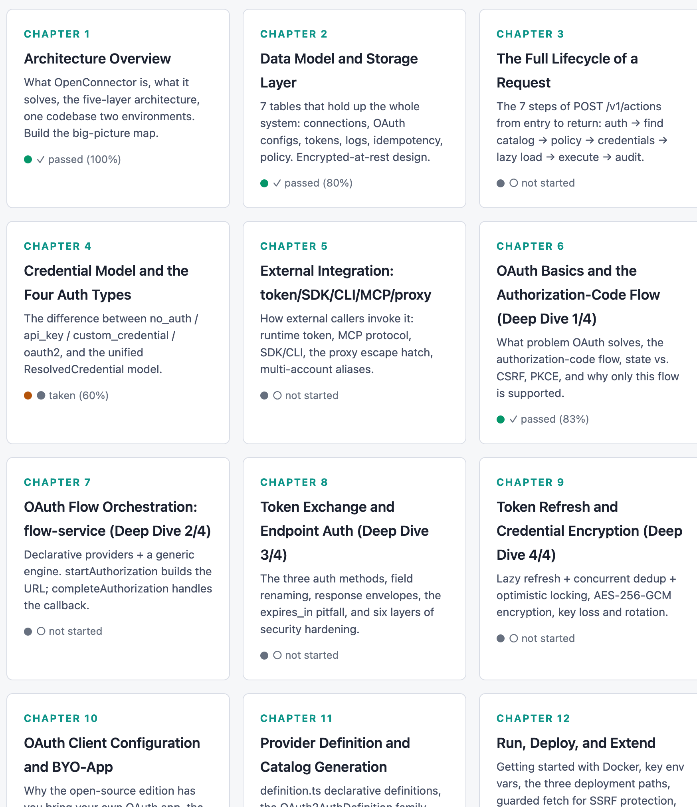
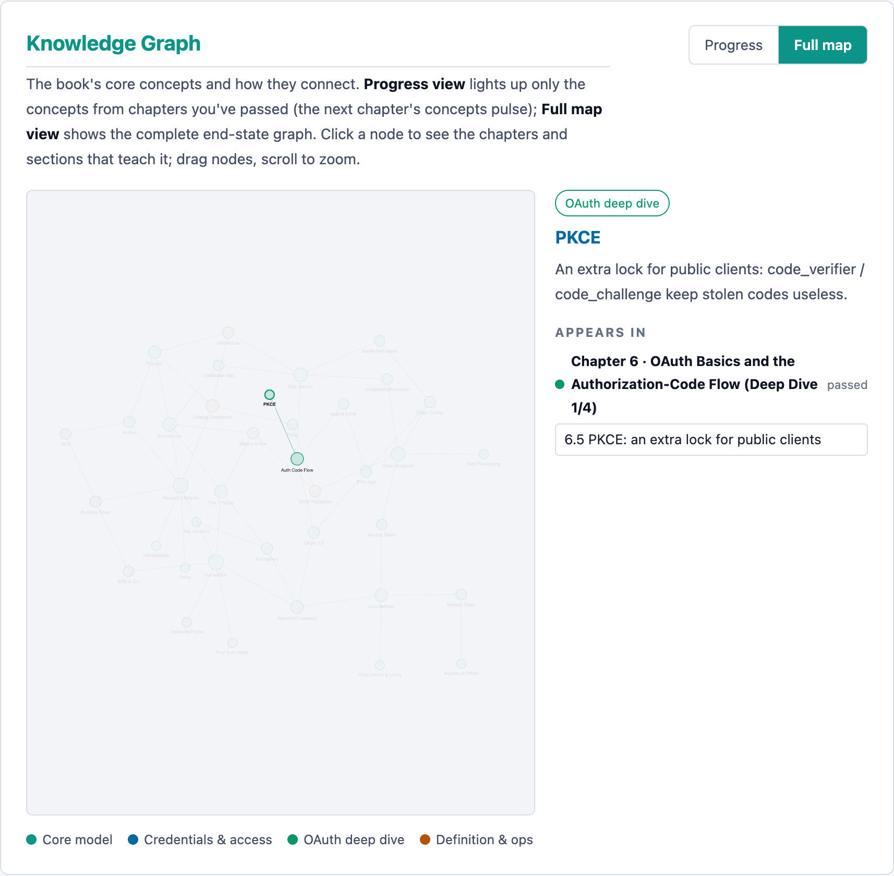
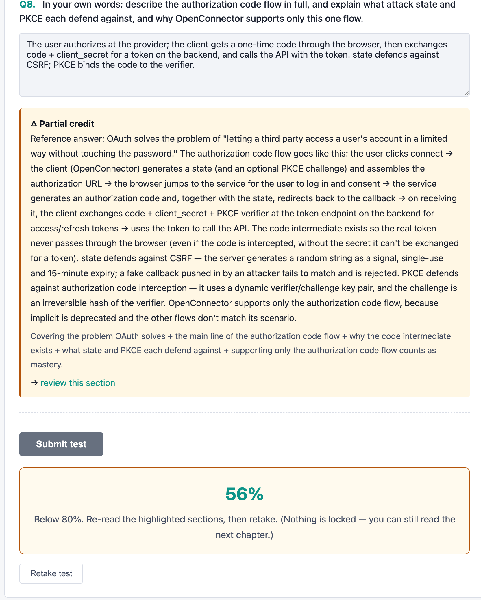
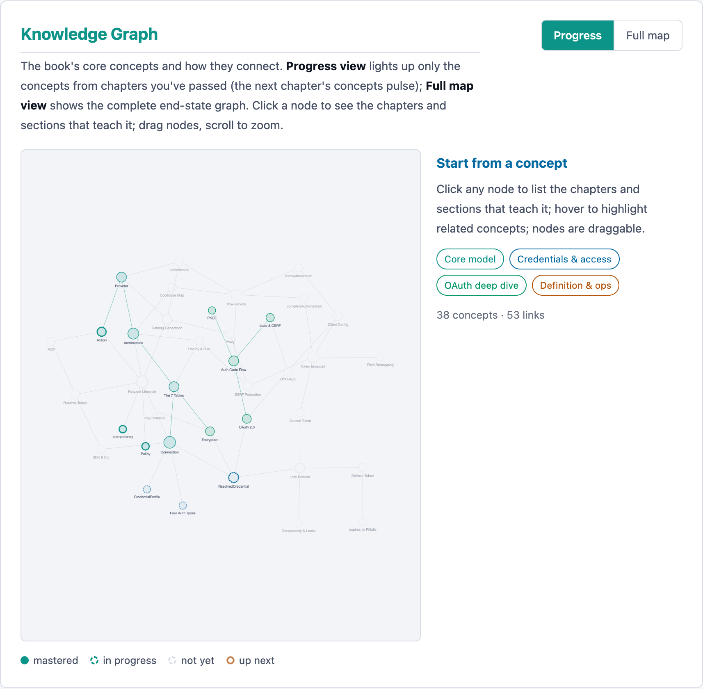

# Forge

*Forge yourself into an expert.*

**English** | [中文](#中文)

A ZCode agent skill that forges any repo, topic, or document pile into a personalized, interactive HTML textbook — written at the depth *you* actually need.
Works with any agent that loads skills from `~/.agents/skills/`.

<p align="center">
  
</p>

---

## What It Does

1. **Calibrates before every chapter** — asks you 2–3 real scenario questions ("here's a snippet — what does it print, and why?"), scores your answers, then picks the depth: skim what you've mastered, teach fully what you haven't.
2. **Builds from any source** — a local **repo** (it reads the actual code, not just the README), a domain **topic**, or **docs & papers** (URLs or files) — in any combination.
3. **Writes a real book, not an essay** — one self-contained HTML file per chapter plus an `index.html` dashboard, with learning objectives, recaps, and a test per chapter.
4. **Draws, doesn't describe** — architecture maps, ER sketches, and sequence flows as pure inline SVG in the theme's palette.
5. **Ships runnable demos** — small per-book widgets (a CSRF attack simulator, a token slider, a step-by-step loop printer) that run in the page.
6. **Maps the knowledge** *(optional)* — a concept graph on the dashboard: concepts light up as you pass chapter tests, and clicking a node deep-links to the exact sections that teach it.
7. **Tests every chapter** — mixed multiple-choice (single + multi), fill-in, and short-answer with self-check; **≥ 80% = learned enough to move forward**.
8. **Fails softly** — wrong answers highlight with a "review this section" link to the exact anchor; nothing locks, retake anytime.
9. **Tracks progress** — scores and chapter status persist in `localStorage`, per book *and* per language.
10. **Speaks your languages** — `en/`, `zh/`, `ja/`, … as parallel sibling folders; switching language is a hyperlink, no runtime switcher.
11. **Light & dark themes** — a toggle in the topbar, preference remembered in `localStorage`; dark is the default.
12. **Stays yours** — static HTML files on your disk: no server, no build step, no account, no internet. Works straight from `file://`.

---

## Screenshots

From a real book forged from the [open-connector-book](https://github.com/JJack27/open-connector-book) repo — 13 chapters on gateway architecture and OAuth, in English and Chinese:

| | |
|---|---|
|  |  |
| **The dashboard** — every chapter as a card: ✓ passed · • below 80% · ○ not taken. | **Knowledge graph** — the book's concepts and relations; click a node to see where it's taught. |
|  |  |
| **Inline SVG diagrams** — layered architecture, ER sketches, flows — drawn, not described. | **Interactive demos** — run a concept in motion; this one simulates a CSRF attack and the `state` defense. |
|  |  |
| **Test feedback** — every wrong answer shows the correct answer, the rationale, and a deep link to re-read. | **The 80% soft gate** — miss it and nothing locks; re-read the highlighted sections and retake. |

<details>
<summary><b>Knowledge graph — progress view</b></summary>
<br>

</details>

---

## Why It Works

| Mechanism | What it does |
|---|---|
| Pre-chapter diagnostics | 2–3 scenario questions per chapter → knowledge-point scoring → a depth band: **skim + advanced**, **targeted**, or **full**. |
| Tests weighted to weak points | Chapter tests probe what you got wrong in the diagnostic, not what you already knew. |
| 80% soft gate | Passing marks a chapter learned; missing highlights exactly which sections to re-read. No locks, no blocked content. |
| Language-neutral anchors | Section ids (`sec-…`) are identical across every translation, so review links and graph references survive any language. |
| `localStorage` records | One key per book × language × chapter — powers the dashboard, the graph's progress view, and survives reloads. |
| Regenerable | Come back to the agent anytime to add, revise, or deepen chapters; enhancements land in the template so the next book inherits them. |

---

## Two Goals

| Goal | Outline driven by | You get |
|---|---|---|
| `domain-expert` | The field's standard conceptual progression | Foundations → core mechanisms → edge cases and pitfalls, calibrated chapter by chapter. |
| `repo-expert` | The repo's actual structure (auto-detected: DB schema, core services, data flow, API surface, contributing map) | An onboarding path through the real code — with docs-vs-implementation gaps flagged and probed in the tests. |

---

## The Pipeline

```
0    Analyze the source(s) — repo / topic / materials
0.5  Ask you: which languages, which goal
1    Propose the outline → you approve
2    For each chapter:
       ask 2–3 scenario questions → score → pick depth band
       write body + SVG diagrams + demos → write the test
3    Assemble the multi-file HTML project
4    Open index.html — done
4.5  Translate into sibling language folders
5    Post-delivery enhancement loop (knowledge graph, dark mode, …)
```

---

## Quick Start

**1 — Install the skill** (discovered from `~/.agents/skills/`):

```bash
git clone https://github.com/JJack27/Forge
cp -r Forge ~/.agents/skills/
```

**2 — Just talk to your agent.** The skill triggers on natural requests — no command to memorize:

> *Make me a book on Rust ownership and borrowing. I've written some Rust but I keep fighting the borrow checker.*

Answer three things as it works — **which languages**, **which goal**, **approve the outline** — then it forges chapter by chapter, calibrating depth as it goes.

**3 — Open the result:**

```bash
open books/<your-book>/en/index.html   # or just double-click it — that's the whole runtime
```

<details>
<summary><b>More example prompts</b></summary>

| Source | Goal | Prompt |
|---|---|---|
| Topic | domain-expert | *"Create a course for me on database indexes. English primary, but I also want Japanese and Spanish versions."* |
| Repo | repo-expert | *"Onboard me to this codebase at `~/projects/some-repo`. I want to actually become an expert on it — DB, services, the works. English and Chinese."* |
| Papers | domain-expert | *"Build me a study guide on distributed consensus from these two papers: \<url1\>, \<url2\>. I know basic distributed systems but Paxos/Raft always confuse me. Chinese."* |
| Any | any | *"Turn this repo into something I can learn from"* · *"onboard me to this codebase"* · *"build me a study guide for Z from these docs"* |

</details>

---

## What You Get

A folder of static HTML — yours to keep, host, or zip up and share:

```
books/your-book/
├── en/                        # one folder per language (en is primary here)
│   ├── index.html             # dashboard: TOC, progress, knowledge graph
│   ├── 01-foundations.html    # one self-contained .html per chapter
│   ├── 02-core-mechanisms.html
│   ├── …
│   └── assets/
│       ├── style.css          # light/dark theme via CSS vars (shared across languages)
│       ├── book.js            # scoring + nav + demos registry (shared)
│       └── graph.js           # knowledge-graph data + engine (optional)
└── zh/                        # sibling folder: same structure, same anchors,
                               # translated prose — language switch is a link
```

- Everything works under `file://` — no server, no build step, no dependencies.
- Tests are fully client-side, scored from `data-*` attributes; results in `localStorage`.
- The knowledge graph renders with Cytoscape.js from a CDN and falls back to a built-in SVG layout offline.

---

## FAQ

<details>
<summary><b>Do I need a server, a build step, or an internet connection?</b></summary>

No. Every chapter is a fully self-contained HTML file that works opened directly via `file://`. The whole book is a folder you can keep anywhere.
</details>

<details>
<summary><b>What can it build a book from?</b></summary>

Three sources, in any combination: a **local repository** (README, tree, key entry points, recent commits), a **topic/domain** (the field's standard progression), or **external materials** — docs, tutorials, papers as URLs or files. With multiple sources, the topic is the skeleton and the repo/materials supply worked examples — unless the goal is `repo-expert`, where the repo's own structure drives the outline.
</details>

<details>
<summary><b>What happens if I fail a chapter test?</b></summary>

Nothing locks — the 80% gate is deliberately soft. The chapter is marked "below 80%" on the dashboard, every wrong question is highlighted with a link to the exact section to re-read, and you can retake anytime.
</details>

<details>
<summary><b>Which agents can use this skill?</b></summary>

Any agent that loads skills from `~/.agents/skills/` — it's an open-format skill (a `SKILL.md` plus reference docs and a book template).
</details>

<details>
<summary><b>Can it write the book in Chinese / Japanese / Spanish / …?</b></summary>

Yes. Ask in the language you want, or name several — e.g. "English primary, plus Chinese and Japanese." Each language gets its own complete sibling folder, and progress is tracked per language.
</details>

<details>
<summary><b>I just want the whole book generated without the questions.</b></summary>

Say so — it will honor it (with a one-time warning that depth calibration will be coarse) and default every chapter to medium depth.
</details>

---

## Repository Layout

```
Forge/
├── SKILL.md                       # the workflow — the skill's entry point
├── references/
│   ├── source-analysis.md         # extracting structure from repo/topic/materials
│   ├── assessment-questions.md    # writing & reading the per-chapter diagnostics
│   ├── test-design.md             # test size, question types, the 80% rule
│   ├── project-structure.md       # HTML layout, data-* schemas, SVG & demos
│   ├── knowledge-graph.md         # concept-graph authoring pipeline + verification
│   └── i18n.md                    # sibling-folder convention & translation rules
└── assets/
    ├── book-template/             # the template project each book starts from
    └── screenshots/               # README screenshots (from the demo book)
```

---

# 中文

**[English](#forge)** | 中文

*把自己锻造成专家。*

一个 ZCode agent skill：把任何代码仓库、主题或文档资料锻造成一本个性化的交互式 HTML 教科书 —— 篇幅深度按你**真实水平**定制。
任何能从 `~/.agents/skills/` 加载 skill 的 agent 都可以使用。

<p align="center">
  
</p>

---

## 它能做什么

1. **每章动笔前先校准** —— 先问你 2–3 个真实场景题（"这段代码会打印什么？为什么？"），按你的回答定深度：已掌握的略过，薄弱的讲透。
2. **任意来源** —— 本地**代码仓库**（读真实代码而非只有 README）、领域**主题**、或**文档与论文**（URL 或文件），可任意组合。
3. **写的是一本书，不是一篇长文** —— 每章一个自包含 HTML 文件，外加 `index.html` 仪表盘；每章有学习目标、回顾和小测。
4. **画图，而不是描述** —— 架构图、ER 草图、时序/流程图，全部用主题配色的内联 SVG。
5. **内置可运行的 demo** —— 每本书自己的小交互组件（CSRF 攻击模拟器、token 滑块、逐步循环打印机），在页面里直接跑。
6. **知识图谱**（可选）—— 仪表盘上的概念图：通过的章节会点亮对应概念；点击节点直达讲解它的章节小节。
7. **每章都有测试** —— 单选、多选、填空、简答自评混合；**≥ 80% 即视为学会**。
8. **温和的失败** —— 答错高亮并附"复习本节"直达链接；不锁任何内容，随时重测。
9. **进度持久化** —— 成绩与章节状态存在 `localStorage`，按书、按语言分别记录。
10. **多语言** —— `en/`、`zh/`、`ja/`… 平行目录；切换语言就是一个链接，无需运行时切换器。
11. **浅色 / 深色主题** —— 顶栏一键切换，偏好存在 `localStorage`；默认深色。
12. **完全属于你** —— 磁盘上的静态 HTML：无服务器、无构建、无账号、无网络，`file://` 直接打开。

（完整截图见上方 [Screenshots](#screenshots)。）

---

## 为什么有效

| 机制 | 作用 |
|---|---|
| 章前诊断 | 每章 2–3 个场景题 → 知识点打分 → 深度档位：**略读+进阶** / **针对性** / **完整讲解**。 |
| 测试偏重薄弱点 | 章末测试针对你诊断中答错的内容出题，而不是考你已经会的。 |
| 80% 软门 | 达标即标记"已学会"；未达标则精确高亮需要重读的小节。不锁内容。 |
| 语言无关锚点 | 小节 id（`sec-…`）在所有语言版本中一致，复习链接和图谱引用在任何语言下都有效。 |
| `localStorage` 记录 | 每书 × 语言 × 章节一条记录 —— 驱动仪表盘、图谱进度视图，刷新不丢。 |
| 可再生成**（regenerable）** | 随时回来让 agent 增删、修订、加深章节；增强会沉淀进模板，下一本书直接继承。 |

---

## 两种目标

| 目标 | 大纲依据 | 你得到 |
|---|---|---|
| `domain-expert` | 该领域的标准概念进阶 | 地基 → 核心机制 → 边界与陷阱，逐章校准深度。 |
| `repo-expert` | 仓库的真实结构（自动识别：数据库 schema、核心服务、数据流、API 面、贡献指南） | 一条沿真实代码的上手路径 —— 文档与实现不符之处会被标出并写进测试。 |

---

## 工作流

```
0    分析来源 —— 仓库 / 主题 / 材料
0.5  问你：语言、目标
1    提出大纲 → 你确认
2    逐章进行：
       问 2–3 个场景题 → 打分 → 定深度档位
       写正文 + SVG 图 + demo → 出测试题
3    组装多文件 HTML 项目
4    打开 index.html —— 完成
4.5  翻译成各语言的兄弟目录
5    交付后增强循环（知识图谱、深色模式……）
```

---

## 快速开始

**1 —— 安装 skill**（从 `~/.agents/skills/` 自动发现）：

```bash
git clone https://github.com/JJack27/Forge
cp -r Forge ~/.agents/skills/
```

**2 —— 直接对 agent 说话**，skill 会在自然请求时自动触发，无需记命令：

> *给我做一本 Rust 所有权和借用机制的书。我写过一些 Rust，但总是和 borrow checker 打架。*

过程中回答三件事 —— **要哪些语言**、**哪种目标**、**确认大纲** —— 之后它逐章锻造、边写边校准深度。

**3 —— 打开成果：**

```bash
open books/<your-book>/zh/index.html   # 或者直接双击 —— 这就是全部运行时
```

---

## 你会得到什么

一个静态 HTML 文件夹 —— 保留、托管、打包分享都随你（结构见上方 [What You Get](#what-you-get)）：

- 一切都能在 `file://` 下工作 —— 无服务器、无构建、无依赖。
- 测试完全在浏览器端评分（基于 `data-*` 属性），结果存 `localStorage`。
- 知识图谱优先用 CDN 的 Cytoscape.js 渲染，离线时自动回退到内置 SVG 布局。

---

## 常见问题

<details>
<summary><b>需要服务器、构建步骤或联网吗？</b></summary>

都不需要。每章都是一个完全自包含的 HTML 文件，`file://` 直接打开即可。整本书就是一个可以放在任何地方的文件夹。
</details>

<details>
<summary><b>可以用什么来源生成书？</b></summary>

三类来源、任意组合：**本地仓库**（README、目录树、关键入口、近期提交）、**主题/领域**（该领域的标准进阶路径）、或**外部材料** —— 文档、教程、论文（URL 或文件）。多来源时以主题为骨架、仓库/材料提供实例；若目标是 `repo-expert`，则由仓库自身结构驱动大纲。
</details>

<details>
<summary><b>章节测试不及格会怎样？</b></summary>

不会锁任何东西 —— 80% 是刻意设计的软门。仪表盘上该章标记"低于 80%"，每道错题高亮并链接到应重读的小节，随时可重测。
</details>

<details>
<summary><b>支持中文 / 日文 / 西班牙文…… 吗？</b></summary>

支持。用对应语言提需求，或指定多种 —— 比如"英文为主，另加中文和日文"。每种语言一个完整目录，进度按语言独立记录。
</details>

<details>
<summary><b>我不想答题，直接生成全书行吗？</b></summary>

可以，说一声即可 —— 它会照办（一次性提醒：深度校准会比较粗），所有章节默认中等深度。
</details>

---

## 仓库结构

```
Forge/
├── SKILL.md                       # 工作流 —— skill 的入口
├── references/                    # 各环节的详细参考文档
│   ├── source-analysis.md         #   从仓库/主题/材料中提取结构
│   ├── assessment-questions.md    #   章前诊断题的编写与判读
│   ├── test-design.md             #   测试规模、题型、80% 规则
│   ├── project-structure.md       #   HTML 布局、data-* 模式、SVG 与 demo
│   ├── knowledge-graph.md         #   知识图谱的数据编写流程与验收清单
│   └── i18n.md                    #   兄弟目录约定与翻译规则
└── assets/
    ├── book-template/             # 每本书起步用的模板项目
    └── screenshots/               # README 截图（来自演示书）
```
