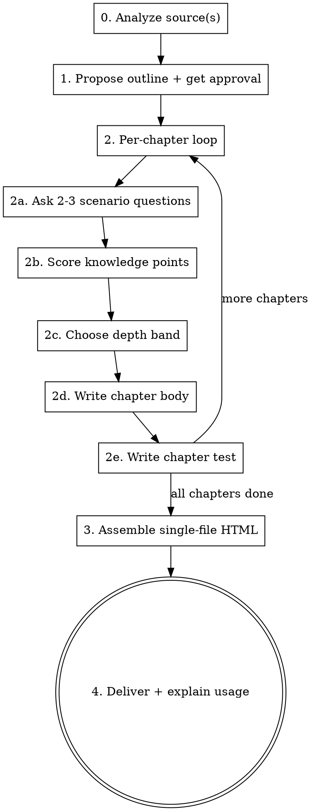

# Personal Book Forger

Forge a single-file HTML learning book that is **calibrated to the learner's actual level**, not a generic reference. The book's source can be a repo, a topic/domain, external materials, or a combination. Each chapter has a test; reaching 80% means the chapter is "learned enough to move forward" (soft gate — never locks).

The defining behavior: **before writing each chapter, ask the learner 2–3 scenario/code-understanding questions, then write the chapter at a depth matched to what they actually know.** This is not optional and not a formality — it is the whole point of the skill.

## How to use this skill

Follow the stages in order. Read each `references/*.md` when you reach the relevant stage. Do not skip stages, and do not batch all chapters at once — the per-chapter conversation is where calibration happens.

## Inputs

Accept any combination of these three sources (at least one required):

- **repo** — a local repository path. Read README, directory tree, key module entry points, and (optionally) recent commits to extract what the repo *can teach*.
- **topic** — a domain or subject area (e.g. "distributed systems", "Rust ownership", "database indexes"). Organize content from general domain knowledge; do not require a specific repo.
- **materials** — URLs or local files (docs, papers, tutorials). Fetch and summarize; extract a knowledge graph from the raw material.

When more than one source is given, use the **topic as the skeleton** and the repo / materials as worked examples and evidence. See `references/source-analysis.md` for per-source analysis rules.

## Workflow

### Stage 0 — Analyze the source(s)

For a repo: read the README, list the top-level tree, open the 2–3 most central module entry points, optionally skim recent commits. Produce a short note: "this repo teaches X, Y, Z."

For a topic: enumerate the domain's accepted conceptual progression (foundations → core mechanisms → advanced → applied). Do not invent a novel structure — follow how the field itself teaches the subject.

For materials: fetch each URL / read each file, summarize each, then merge into a combined knowledge graph.

Record the analysis briefly in the conversation so the learner sees what you extracted. Details in `references/source-analysis.md`.

### Stage 1 — Propose the outline and get approval

Produce a chapter outline. For each chapter give:

- Chapter number and title
- One sentence: *what this chapter covers and why it sits here in the progression*
- A draft learning-objectives list (3–5 bullet points)
- A predicted depth band (shallow / medium / deep) — your initial guess, to be re-calibrated per chapter in Stage 2

Present the outline and **require explicit approval before generating any chapter** (use AskUserQuestion or just ask and wait). The learner may add, remove, reorder, or merge chapters. This outline gate is what prevents sinking effort into the wrong structure.

### Stage 2 — Per-chapter generation loop

This is the heart of the skill. Run this loop once per chapter. **Do not pre-generate all chapters** — each chapter's depth depends on a conversation that hasn't happened yet.

**2a. Ask 2–3 scenario / code-understanding questions.** Not "do you know X?" — ask applied questions: "what does this snippet output and why?", "if symptom Y occurs, what's the most likely root cause?", "which of these two designs breaks under Z and why?". Wait for the learner's answer. Full guidance in `references/assessment-questions.md`.

**2b. Score knowledge points.** From the learner's answers, split the chapter into its constituent knowledge points and tag each as `mastered` / `partial` / `unknown`. Be honest — do not inflate. If the learner's answer is vague or hand-wavy, that's `partial`, not `mastered`.

**2c. Choose the depth band for the chapter:**

| Knowledge state of the chapter's points | Depth | What to write |
|---|---|---|
| All `mastered` | **skim + advanced** | A short summary (a few sentences) + go straight to edge cases, common pitfalls, advanced notes. Do not re-teach the basics. |
| Mixed (`mastered` + `partial`/`unknown`) | **targeted** | Briefly recap the points they know, then teach the weak points in full. |
| All `unknown` | **full** | Teach the chapter completely, foundations up. |

**2d. Write the chapter body.** Include, as applicable:

- Main explanation, at the depth chosen above
- Code examples / source snippets — if the source is a repo, cite real file paths and line numbers
- Learning objectives list (refined from the outline draft)
- Common pitfalls / contrasts with adjacent concepts / further reading

**2e. Write the chapter test.** 8–15 questions mixing the three question types the learner asked for: multiple-choice, fill-in-the-blank / code-fill, and short-answer with self-checked key points. **Weight questions toward the points the assessment showed were weak.** Every question ships with its answer, a rationale, and an in-book anchor (e.g. "see §3.2"). Test design rules in `references/test-design.md`.

After 2e, confirm with the learner before moving to the next chapter. They may ask you to revise this chapter's body or test.

### Stage 3 — Assemble the single-file HTML

Assemble every chapter plus a table-of-contents page and a progress dashboard into **one self-contained `.html` file**: all CSS and JS inlined, no external requests, openable by double-click.

Test mechanics (all client-side, no backend):

- **Multiple-choice** — exact match against the correct option(s)
- **Fill-in-the-blank / code-fill** — normalized string comparison (trim, collapse whitespace, case-insensitive unless the answer is case-sensitive). Accept a small set of equivalent answers per blank.
- **Short-answer** — show the reference answer as a checklist of key points; the learner self-checks which points they actually addressed; score = (checked points) / (total points). Be honest guidance above the checklist: "only check a point if you actually covered it — cheating here only hurts you."

Scoring and the 80% rule:

- Each chapter test produces a percentage. **≥ 80% → "learned enough to move forward."** The chapter gets a green check on the TOC and dashboard.
- **< 80% is a soft gate, never a lock.** The learner can always read the next chapter. But: the TOC marks the chapter yellow, and on the test results page every wrong question is highlighted with a link to the exact book section to re-read ("review §3.2 — you missed the distinction between X and Y").

Persistence: store test scores and per-chapter completion in `localStorage` keyed by book slug, so progress survives reloads.

Use `assets/book-template.html` as the starting skeleton — it has the TOC, dashboard, CSS, and test-scoring JS already wired. See `references/html-template.md` for the conventions and how to fill in chapters.

### Stage 4 — Deliver and explain usage

- Write the final file to `./books/<topic-slug>/book.html` unless the learner specified otherwise.
- Tell the learner:
  - How to open it (just double-click)
  - That progress and scores are saved in the browser's `localStorage`
  - How to re-take a test (button on each chapter)
  - How to come back to you (the agent) to add, revise, or deepen chapters — the single-file HTML is regenerable from the skill

## Style and tone

- Write the book in the same language the learner is using, unless they ask otherwise.
- Explanations should feel like a tutor talking, not a textbook lecturing. Use "you", concrete examples, and the learner's own weak points as motivation.
- Code examples must be runnable or at least syntactically honest. Never invent APIs.
- Prefer fewer, well-chosen test questions over many shallow ones. A good test question makes the learner think, not just recall.

## When to deviate

- If the learner says "just generate the whole book, don't ask me questions" — honor it, but warn once that depth calibration will be coarse. Default to `medium` depth across all chapters in that case.
- If a chapter has no meaningful test (e.g. pure narrative), say so explicitly and skip the test for that chapter rather than fabricating shallow questions.
- If the source is enormous (huge monorepo, 50+ papers), propose an explicit scope cut at Stage 1 rather than trying to cover everything.
