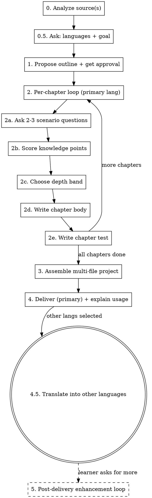

# Personal Book Forger

Forge a **multi-file HTML learning book**, calibrated to the learner's actual level — not a generic reference. The book's source can be a repo, a topic/domain, external materials, or a combination. Two goals: make the learner an **expert of a domain**, or an **expert of a specific repo** (with onboarding chapters for DB schema, core services, data flow, etc.). The book can be authored in multiple languages (parallel sibling folders). Each chapter has a test; reaching 80% means the chapter is "learned enough to move forward" (soft gate — never locks).

The output is **one self-contained `.html` file per chapter** (plus an `index.html` dashboard and a shared `assets/` folder per language). No build step, no server, no `fetch()` — every chapter works opened directly via `file://`. Diagrams are inline SVG; interactive widgets are `
` elements backed by a small registry the author adds to `assets/book.js`.

The defining behavior: **before writing each chapter, ask the learner 2–3 scenario/code-understanding questions, then write the chapter at a depth matched to what they actually know.** This is not optional and not a formality — it is the whole point of the skill.

## How to use this skill

Follow the stages in order. Read each `references/*.md` when you reach the relevant stage. Do not skip stages, and do not batch all chapters at once — the per-chapter conversation is where calibration happens.

## Inputs

Accept any combination of these three sources (at least one required):

- **repo** — a local repository path. Read README, directory tree, key module entry points, and (optionally) recent commits to extract what the repo *can teach*.
- **topic** — a domain or subject area (e.g. "distributed systems", "Rust ownership", "database indexes"). Organize content from general domain knowledge; do not require a specific repo.
- **materials** — URLs or local files (docs, papers, tutorials). Fetch and summarize; extract a knowledge graph from the raw material.

When more than one source is given, use the **topic as the skeleton** and the repo / materials as worked examples and evidence — **unless the goal is `repo-expert`**, in which case the repo's own structure drives the outline. See `references/source-analysis.md` for per-source analysis rules and repo-onboarding detection.

## Workflow

### Stage 0 — Analyze the source(s)

For a repo: read the README, list the top-level tree, open the 2–3 most central module entry points, optionally skim recent commits. Produce a short note: "this repo teaches X, Y, Z." **If the source is a repo, also run repo-onboarding detection** (see `references/source-analysis.md` → "Repo onboarding detection") and produce an artifact inventory — this drives the outline if the goal turns out to be `repo-expert`.

For a topic: enumerate the domain's accepted conceptual progression (foundations → core mechanisms → advanced → applied). Do not invent a novel structure — follow how the field itself teaches the subject.

For materials: fetch each URL / read each file, summarize each, then merge into a combined knowledge graph.

Record the analysis briefly in the conversation so the learner sees what you extracted. Details in `references/source-analysis.md`.

### Stage 0.5 — Ask the learner for languages and goal

Ask two things before proposing the outline (they shape it):

- **Languages:** which language(s) the book should be in (multi-select). The language the learner is chatting in is the **primary** — the book is built end-to-end in it first; others are added by translation in Stage 4.5. At minimum the learner will pick one; default to the chat language if they don't specify.
- **Goal:** `domain-expert` or `repo-expert`. This decides the outline shape at Stage 1.
  - `domain-expert` — the learner wants to master the field. The topic provides the skeleton.
  - `repo-expert` — the learner wants to master *this specific repo* (onboarding). The repo's own structure drives the outline; onboarding chapters (DB schema, core services, data flow, …) are included for each artifact detected at Stage 0.

Use AskUserQuestion for both. If the learner's request already makes one of these obvious (e.g. "onboard me to this repo" → `repo-expert` + the chat language), confirm rather than interrogate.

### Stage 1 — Propose the outline and get approval

Produce a chapter outline, shaped by the goal:

- **`domain-expert`:** concept-progression outline (foundations → core mechanisms → advanced → applied). The repo (if any) supplies examples, not structure.
- **`repo-expert`:** a Repository Onboarding arc — architecture overview → (detected onboarding artifacts in dependency order: schema before services that use it, services before data flow) → key domain concepts → API surface → dev environment → contributing map. **Only include chapters for artifacts the repo actually has** (from the Stage 0 inventory). Don't fabricate a "DB schema" chapter for a repo with no database.

For each chapter give:

- Chapter number and title
- One sentence: *what this chapter covers and why it sits here in the progression*
- A draft learning-objectives list (3–5 bullet points)
- A predicted depth band (shallow / medium / deep) — your initial guess, to be re-calibrated per chapter in Stage 2

Present the outline and **require explicit approval before generating any chapter** (use AskUserQuestion or just ask and wait). The learner may add, remove, reorder, or merge chapters. This outline gate is what prevents sinking effort into the wrong structure.

### Stage 2 — Per-chapter generation loop

This is the heart of the skill. Run this loop once per chapter. **Do not pre-generate all chapters** — each chapter's depth depends on a conversation that hasn't happened yet.

**2a. Ask 2–3 scenario / code-understanding questions.** Not "do you know X?" — ask applied questions: "what does this snippet output and why?", "if symptom Y occurs, what's the most likely root cause?", "which of these two designs breaks under Z and why?". Wait for the learner's answer. Full guidance in `references/assessment-questions.md`.

**2b. Score knowledge points.** From the learner's answers, split the chapter into its constituent knowledge points and tag each as `mastered` / `partial` / `unknown`. Be honest — do not inflate. If the learner's answer is vague or hand-wavy, that's `partial`, not `mastered`.

**2c. Choose the depth band for the chapter:**

| Knowledge state of the chapter's points | Depth | What to write |
|---|---|---|
| All `mastered` | **skim + advanced** | A short summary (a few sentences) + go straight to edge cases, common pitfalls, advanced notes. Do not re-teach the basics. |
| Mixed (`mastered` + `partial`/`unknown`) | **targeted** | Briefly recap the points they know, then teach the weak points in full. |
| All `unknown` | **full** | Teach the chapter completely, foundations up. |

**2d. Write the chapter body.** Include, as applicable:

- Main explanation, at the depth chosen above
- Code examples / source snippets — if the source is a repo, cite real file paths and line numbers. For `repo-expert` goal onboarding chapters, this is the core of the chapter: real schema files, real service entry points, real route handlers, with citations.
- **Inline SVG diagrams** (`<figure class="diagram"><svg viewBox="…">…</svg><figcaption>…</figcaption></figure>`) when a concept is better shown than described. No external images, no D3, no `fetch()`. The book has **light and dark themes** (reader toggles from the topbar) — diagrams must adapt to both, so take colors from the page's CSS variables via **style attributes** (SVG presentation attributes can't hold `var()`): `style="fill:var(--surface-2);stroke:var(--accent)"` for panels, `var(--fg)`/`var(--fg-dim)`/`var(--muted)` for text, `var(--accent)`/`var(--accent-2)`/`var(--pass)`/`var(--fail)`/`var(--warn)` for semantic emphasis. **Never hardcode hex colors in a diagram** — a dark panel or light text becomes invisible in the other theme. Default to including a diagram when:
  - The chapter is about **relationships or structure** (DB schema → ER diagram, architecture → subsystem map, class relationships → inheritance graph).
  - The chapter is about **flow or process** (request lifecycle → flow diagram, event ordering → sequence diagram, layering → stacked-panel diagram).
  - The chapter is about **a contrast or a taxonomy** (two designs side-by-side, three layers of detection, four question types) — side-by-side panels with a short caption beats a paragraph of prose.
- **Interactive demos** (`
…<button data-run>…</button>
…

`) when the learner should *see* a concept in motion (a hash stability demo, a per-site token slider, a perceive-decide-act loop printing step by step). Each demo is backed by a handler you add to the `demos = {}` registry in `assets/book.js`; the harness binds it to the demo's `<button data-run>` automatically. Keep demos small and self-contained (no reaching outside the demo's root element). Add the handler to `book.js` once, reference it by name from any chapter.
- Learning objectives list (refined from the outline draft)
- Common pitfalls / contrasts with adjacent concepts / further reading

**Honest scope (especially for `repo-expert`).** If the source is a repo, read the **actual files** (source, patches, code) — not just the README and docs. Where the docs describe an aspirational design that the committed code doesn't fully implement, flag it explicitly in the chapter and probe it in the test. A reader who trusts the doc will credit the implementation for guarantees it doesn't provide; the book's job is to be more trustworthy than the doc. This is often the most valuable thing the book can do.

**2e. Write the chapter test.** 8–15 questions mixing the three available question types: multiple-choice (single-select and multi-select), fill-in-the-blank / code-fill, and short-answer with self-checked key points. **Weight questions toward the points the assessment showed were weak.** Every question ships with its answer, a rationale, and an in-book anchor (the section id, e.g. `sec-ownership-rules` — anchors are language-neutral). Test design rules in `references/test-design.md`.

After 2e, confirm with the learner before moving to the next chapter. They may ask you to revise this chapter's body or test.

### Stage 3 — Assemble the multi-file project

Assemble every chapter (in the **primary language only** for now) into the multi-file project structure. Start from `assets/book-template/` (copy the whole folder to `./books/<book-slug>/`) and fill in:

- `<primary-lang>/index.html` — set the dashboard title/subtitle, the inline `window.BOOK_CONFIG` (slug + lang + chapters list), and `window.CHAPTER_DESCS` (title + one-line description per chapter, dashboard-only).
- `<primary-lang>/01-…-slug.html … 0N-…-slug.html` — one self-contained HTML file per chapter. Copy `01-example-chapter.html` as the canonical reference; mirror its structure exactly (topbar, inline `BOOK_CONFIG`, chapter-header, objectives, `sec-*` subsections, recap, pitfalls, `<form class="test">`). The same inline `window.BOOK_CONFIG` object appears on every page.
- `<primary-lang>/assets/book.js` — add your book's demos to the `demos = {}` registry. Everything else (scoring, nav, dashboard) is already wired and shared verbatim across all language folders.
- `<primary-lang>/assets/graph.js` — *(optional)* the index-page **knowledge graph** ships wired in the template. Author the concept data between the `DATA START/END` markers (concepts, domain clusters, per-chapter section refs); the engine, styles, and CDN tags are ready. Delete the `.kg` section in `index.html` and the script tags to omit the feature. Authoring pipeline + verification checklist in `references/knowledge-graph.md`.
- Rename the `en/` folder to your primary language code if it isn't English (`zh/`, `es/`, etc.).

Don't touch `assets/style.css` or the scoring/nav/theme/dashboard portions of `assets/book.js` — they're shared verbatim across all language folders and already wired (the light/dark toggle button is auto-injected into the topbar; the `<head>` theme snippet from the template pages must be copied verbatim into every page).

Test mechanics (all client-side, no backend — implemented in `assets/book.js`, scores via `data-*` attributes on each `
`):

- **Multiple-choice** (`data-type="mcq"`) — single-select by default; add `data-multiselect="true"` for checkbox multi-select. Correct options in `data-correct='["b"]'` (JSON array, single-quoted).
- **Fill-in-the-blank / code-fill** (`data-type="fill"`) — normalized string comparison (trim, lowercase, collapse whitespace). Accepted answers in `data-accepted='["ans1","ans2"]'`. Multi-blank is order-tolerant.
- **Short-answer** (`data-type="short"`) — key-point checklist in `data-key-points='["p1","p2",…]'`, self-checked by the learner; score = (checked points) / (total points). The honesty framing ("only check a point if you actually addressed it — cheating here only hurts you") is built into the template.
- Every question also carries `data-answer` (revealed reference answer), `data-rationale` (why), and `data-review="sec-…"` (the section anchor the "review this section" link jumps to).

Scoring and the 80% rule (implemented in `assets/book.js`):

- Each chapter test produces a percentage. **≥ 80% → "learned enough to move forward."** The chapter gets a green check on the TOC and dashboard.
- **< 80% is a soft gate, never a lock.** The learner can always read the next chapter. But: the TOC marks the chapter yellow, and on the test results page every wrong question is highlighted with a link to the exact book section to re-read ("review this section — you missed the distinction between X and Y").
- Scores persist in `localStorage` keyed by **book slug AND language** (`book:<slug>:<lang>:ch:<n>`), so progress is tracked per language automatically — the per-page `window.BOOK_CONFIG.lang` field drives the key.

Full project layout, the chapter HTML anatomy, the `data-*` attribute schemas per question type, and verification steps in `references/project-structure.md`.

### Stage 4 — Deliver (primary language) and explain usage

- Write the project directory to `./books/<book-slug>/` unless the learner specified otherwise.
- Tell the learner:
  - **Just open `<primary-lang>/index.html` directly in a browser.** No server, no build step, no internet connection required — every chapter is fully self-contained HTML and works under `file://`.
  - That the book has **light and dark themes** — the ☀/☾ toggle in the topbar switches (persisted in `localStorage`, defaults to the OS preference on first visit).
  - That progress and scores are saved in the browser's `localStorage`, per language.
  - How to switch languages: the `lang-toggle` link in the top-right of any page jumps to the parallel file in the other language's folder. (Other languages are added in Stage 4.5.)
  - How to re-take a test (button on each chapter).
  - How to come back to you (the agent) to add, revise, or deepen chapters — the project is regenerable from the skill.

### Stage 4.5 — Translate into the other selected languages

For each additional language the learner selected at Stage 0.5 (after the primary-language book is delivered and approved):

1. Copy the entire `<primary-lang>/` folder → `<newlang>/` (e.g. `en/` → `zh/`). Copy the `assets/` subfolder verbatim — `book.js` and `style.css` are identical across languages.
2. For each chapter HTML file: translate the prose (chapter title, eyebrow, lede, objectives, body paragraphs, list items, table cells, figcaptions, box content, test prompts/answers/rationales/key-points). **Do NOT translate**: code blocks, file paths, HTML tags/attributes, section ids (`sec-…`), `data-correct`/`data-accepted` values that are code symbols, `data-review` values, the `window.BOOK_CONFIG` script block (except flip `lang: "en"` → `lang: "zh"`).
3. On every file in the new folder: change `<html lang="en">` → `<html lang="<newlang>">`, and flip the `lang-toggle` link to point back at the primary language (`href="../en/…"` with text like `→ English`).
4. Verify the i18n invariant: same section ids, same question count per chapter, same `data-correct`/`data-accepted` for code-symbol answers, same `data-review` anchors, same `data-key-points` count. (See "Verifying the project" in `references/project-structure.md` for the script.)
5. Tell the learner the language is ready and ask whether to continue to the next selected language.

Full translation guidance (what to translate, what to leave, how to keep the invariant) in `references/i18n.md`.

### Stage 5 — Post-delivery enhancement loop (optional)

Books are regenerable, and learners come back with asks ("show me how it all
connects", "add a dark mode", "graph my progress"). Treat each enhancement as
a small feature loop: **explore the delivered project → design → implement →
verify in a browser (language × theme × progress-state matrix) → refresh the
README + screenshots**. Keep the project's conventions — zero build step,
`file://` must keep working, assets byte-identical across language folders —
and prefer enhancing the shipped template so the next book inherits it.

Shipped enhancement: the **knowledge graph** (Stage 3 bullet above). When the
learner asks for it post-delivery, follow `references/knowledge-graph.md` end
to end — it contains the anchor-extraction pipeline, the data schema, the
Cytoscape CDN script-order gotcha, and the full verification matrix.

## Style and tone

- Write the book in the learner's selected primary language, unless they ask otherwise.
- Explanations should feel like a tutor talking, not a textbook lecturing. Use "you", concrete examples, and the learner's own weak points as motivation.
- Code examples must be runnable or at least syntactically honest. Never invent APIs. For `repo-expert` chapters, cite real file paths and line numbers from the actual repo.
- Prefer fewer, well-chosen test questions over many shallow ones. A good test question makes the learner think, not just recall.

## When to deviate

- If the learner says "just generate the whole book, don't ask me questions" — honor it, but warn once that depth calibration will be coarse. Default to `medium` depth across all chapters in that case.
- If the learner picks only one language, skip Stage 4.5 entirely.
- If a chapter has no meaningful test (e.g. pure narrative), say so explicitly and skip the test for that chapter rather than fabricating shallow questions.
- If the source is enormous (huge monorepo, 50+ papers), propose an explicit scope cut at Stage 1 rather than trying to cover everything. For `repo-expert` on a very large repo, propose covering one subsystem end-to-end rather than the whole thing shallowly.
