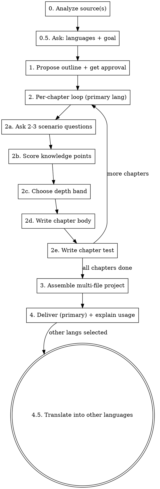

# Personal Book Forger

Forge a **multi-file HTML learning book with internationalization and D3/SVG interactive visualizations**, calibrated to the learner's actual level — not a generic reference. The book's source can be a repo, a topic/domain, external materials, or a combination. Two goals: make the learner an **expert of a domain**, or an **expert of a specific repo** (with onboarding chapters for DB schema, core services, data flow, etc.). The book can be authored in multiple languages (runtime language switcher). Each chapter has a test; reaching 80% means the chapter is "learned enough to move forward" (soft gate — never locks).

The defining behavior: **before writing each chapter, ask the learner 2–3 scenario/code-understanding questions, then write the chapter at a depth matched to what they actually know.** This is not optional and not a formality — it is the whole point of the skill.

Visualizations (chapter-level diagrams/simulations/charts, and interactive D3 questions inside tests) are authored as raw D3 code in the chapter JSON and rendered by the template's `js/viz.js` runner. See `references/visualizations.md` for the full contract.

## How to use this skill

Follow the stages in order. Read each `references/*.md` when you reach the relevant stage. Do not skip stages, and do not batch all chapters at once — the per-chapter conversation is where calibration happens.

## Inputs

Accept any combination of these three sources (at least one required):

- **repo** — a local repository path. Read README, directory tree, key module entry points, and (optionally) recent commits to extract what the repo *can teach*.
- **topic** — a domain or subject area (e.g. "distributed systems", "Rust ownership", "database indexes"). Organize content from general domain knowledge; do not require a specific repo.
- **materials** — URLs or local files (docs, papers, tutorials). Fetch and summarize; extract a knowledge graph from the raw material.

When more than one source is given, use the **topic as the skeleton** and the repo / materials as worked examples and evidence — **unless the goal is `repo-expert`**, in which case the repo's own structure drives the outline. See `references/source-analysis.md` for per-source analysis rules and repo-onboarding detection.

## Workflow

### Stage 0 — Analyze the source(s)

For a repo: read the README, list the top-level tree, open the 2–3 most central module entry points, optionally skim recent commits. Produce a short note: "this repo teaches X, Y, Z." **If the source is a repo, also run repo-onboarding detection** (see `references/source-analysis.md` → "Repo onboarding detection") and produce an artifact inventory — this drives the outline if the goal turns out to be `repo-expert`.

For a topic: enumerate the domain's accepted conceptual progression (foundations → core mechanisms → advanced → applied). Do not invent a novel structure — follow how the field itself teaches the subject.

For materials: fetch each URL / read each file, summarize each, then merge into a combined knowledge graph.

Record the analysis briefly in the conversation so the learner sees what you extracted. Details in `references/source-analysis.md`.

### Stage 0.5 — Ask the learner for languages and goal

Ask two things before proposing the outline (they shape it):

- **Languages:** which language(s) the book should be in (multi-select). The language the learner is chatting in is the **primary** — the book is built end-to-end in it first; others are added by translation in Stage 4.5. At minimum the learner will pick one; default to the chat language if they don't specify.
- **Goal:** `domain-expert` or `repo-expert`. This decides the outline shape at Stage 1.
  - `domain-expert` — the learner wants to master the field. The topic provides the skeleton.
  - `repo-expert` — the learner wants to master *this specific repo* (onboarding). The repo's own structure drives the outline; onboarding chapters (DB schema, core services, data flow, …) are included for each artifact detected at Stage 0.

Use AskUserQuestion for both. If the learner's request already makes one of these obvious (e.g. "onboard me to this repo" → `repo-expert` + the chat language), confirm rather than interrogate.

### Stage 1 — Propose the outline and get approval

Produce a chapter outline, shaped by the goal:

- **`domain-expert`:** concept-progression outline (foundations → core mechanisms → advanced → applied). The repo (if any) supplies examples, not structure.
- **`repo-expert`:** a Repository Onboarding arc — architecture overview → (detected onboarding artifacts in dependency order: schema before services that use it, services before data flow) → key domain concepts → API surface → dev environment → contributing map. **Only include chapters for artifacts the repo actually has** (from the Stage 0 inventory). Don't fabricate a "DB schema" chapter for a repo with no database.

For each chapter give:

- Chapter number and title
- One sentence: *what this chapter covers and why it sits here in the progression*
- A draft learning-objectives list (3–5 bullet points)
- A predicted depth band (shallow / medium / deep) — your initial guess, to be re-calibrated per chapter in Stage 2

Present the outline and **require explicit approval before generating any chapter** (use AskUserQuestion or just ask and wait). The learner may add, remove, reorder, or merge chapters. This outline gate is what prevents sinking effort into the wrong structure.

### Stage 2 — Per-chapter generation loop

This is the heart of the skill. Run this loop once per chapter. **Do not pre-generate all chapters** — each chapter's depth depends on a conversation that hasn't happened yet.

**2a. Ask 2–3 scenario / code-understanding questions.** Not "do you know X?" — ask applied questions: "what does this snippet output and why?", "if symptom Y occurs, what's the most likely root cause?", "which of these two designs breaks under Z and why?". Wait for the learner's answer. Full guidance in `references/assessment-questions.md`.

**2b. Score knowledge points.** From the learner's answers, split the chapter into its constituent knowledge points and tag each as `mastered` / `partial` / `unknown`. Be honest — do not inflate. If the learner's answer is vague or hand-wavy, that's `partial`, not `mastered`.

**2c. Choose the depth band for the chapter:**

| Knowledge state of the chapter's points | Depth | What to write |
|---|---|---|
| All `mastered` | **skim + advanced** | A short summary (a few sentences) + go straight to edge cases, common pitfalls, advanced notes. Do not re-teach the basics. |
| Mixed (`mastered` + `partial`/`unknown`) | **targeted** | Briefly recap the points they know, then teach the weak points in full. |
| All `unknown` | **full** | Teach the chapter completely, foundations up. |

**2d. Write the chapter body.** Include, as applicable:

- Main explanation, at the depth chosen above
- Code examples / source snippets — if the source is a repo, cite real file paths and line numbers. For `repo-expert` goal onboarding chapters, this is the core of the chapter: real schema files, real service entry points, real route handlers, with citations.
- **D3/SVG visualizations** when a concept is better shown than described. Add entries to the chapter's `viz[]` array — raw D3 code that renders into a container. Default to including a viz when:
  - The chapter is about **relationships or structure** (DB schema → ER diagram, architecture → subsystem map, class relationships → inheritance graph).
  - The chapter is about **flow or process** (request lifecycle → flow stepper, event ordering → sequence diagram, algorithm states → step-through simulation).
  - The chapter is about **data or trade-offs** (latency distributions, complexity curves, benchmark comparisons → bar/line/scatter charts).
  Use the chapter's `viz[]` array (append to body in order) or drop a `
">
` placeholder in `bodyHtml` for precise placement. Full authoring conventions and worked examples in `references/visualizations.md`.
- Learning objectives list (refined from the outline draft)
- Common pitfalls / contrasts with adjacent concepts / further reading

**2e. Write the chapter test.** 8–15 questions mixing the available question types: multiple-choice, fill-in-the-blank / code-fill, short-answer with self-checked key points, and (when the interaction genuinely tests understanding a static question can't) **interactive D3 questions**. **Weight questions toward the points the assessment showed were weak.** Every question ships with its answer, a rationale, and an in-book anchor (the section id, e.g. `sec-ownership-rules` — anchors are language-neutral). Test design rules in `references/test-design.md`; the interactive type and the viz contract in `references/visualizations.md`.

Use the `interactive` question type sparingly — only when the learner has to *do* something (trace a failure on a real diagram, reorder a pipeline, tune a value to meet a constraint) that a multiple-choice question couldn't test as well. Authoring an interactive question costs more than a static one; don't use it where it isn't earning its keep.

After 2e, confirm with the learner before moving to the next chapter. They may ask you to revise this chapter's body or test.

### Stage 3 — Assemble the multi-file project

Assemble every chapter (in the **primary language only** for now) into the multi-file project structure. Start from `assets/book-template/` and fill in:

- `locales/<primary-lang>.json` — UI strings (translate the template's `en.json` if the primary language isn't English).
- `content/<primary-lang>/meta.json` — book title, subtitle, ordered chapter manifest.
- `content/<primary-lang>/ch-01.json … ch-XX.json` — one file per chapter.
- `js/main.js` — set `BOOK_SLUG` to a unique kebab-case id for the book.

Don't touch `index.html`, `css/`, or the other `js/` files — they're already wired.

Test mechanics (all client-side, no backend — already implemented in `js/scoring.js` + `js/main.js`):

- **Multiple-choice** — exact match against the correct option(s)
- **Fill-in-the-blank / code-fill** — normalized string comparison (trim, collapse whitespace, case-insensitive unless the answer is case-sensitive). Accept a small set of equivalent answers per blank.
- **Short-answer** — show the reference answer as a checklist of key points; the learner self-checks which points they actually addressed; score = (checked points) / (total points). Be honest guidance above the checklist: "only check a point if you actually covered it — cheating here only hurts you."

Scoring and the 80% rule (already implemented in `js/dashboard.js`):

- Each chapter test produces a percentage. **≥ 80% → "learned enough to move forward."** The chapter gets a green check on the TOC and dashboard.
- **< 80% is a soft gate, never a lock.** The learner can always read the next chapter. But: the TOC marks the chapter yellow, and on the test results page every wrong question is highlighted with a link to the exact book section to re-read ("review this section — you missed the distinction between X and Y").
- Scores persist in `localStorage` keyed by **book slug AND language** (`book:<slug>:<lang>:ch:<n>`), so progress is tracked per language.

Full project layout, file schemas, and verification steps in `references/project-structure.md`.

### Stage 4 — Deliver (primary language) and explain usage

- Write the project directory to `./books/<book-slug>/` (containing `index.html`, `css/`, `js/`, `locales/`, `content/`) unless the learner specified otherwise.
- Tell the learner:
  - **The project must be served over HTTP, not opened via `file://`.** Easiest: `cd` into the project dir and run `./start.sh` (or `python3 -m http.server 8000`), then open `http://localhost:8000`. The browser blocks `fetch()` of local JSON under `file://`, which would break the book.
  - That progress and scores are saved in the browser's `localStorage`, per language.
  - How to switch languages (the `<select>` at the bottom of the TOC) — and that only the primary language is populated so far if other languages were selected.
  - How to re-take a test (button on each chapter).
  - How to come back to you (the agent) to add, revise, or deepen chapters — the project is regenerable from the skill.

### Stage 4.5 — Translate into the other selected languages

For each additional language the learner selected at Stage 0.5 (after the primary-language book is delivered and approved):

1. Translate `locales/<primary>.json` → `locales/<newlang>.json` (same keys, translated values).
2. Translate every file in `content/<primary>/` → `content/<newlang>/` (same structure, same anchors, same test logic — only prose changes).
3. Add the new language code to `SUPPORTED` in `js/i18n.js`.
4. Verify the i18n invariant: same keys, same chapter structure, same anchors, same number/type/order of test questions per chapter. (See "Verifying the project" in `references/project-structure.md`.)
5. Tell the learner the language is ready and ask whether to continue to the next selected language.

Full translation guidance (what to translate, what to leave, how to keep the invariant) in `references/i18n.md`.

## Style and tone

- Write the book in the learner's selected primary language, unless they ask otherwise.
- Explanations should feel like a tutor talking, not a textbook lecturing. Use "you", concrete examples, and the learner's own weak points as motivation.
- Code examples must be runnable or at least syntactically honest. Never invent APIs. For `repo-expert` chapters, cite real file paths and line numbers from the actual repo.
- Prefer fewer, well-chosen test questions over many shallow ones. A good test question makes the learner think, not just recall.

## When to deviate

- If the learner says "just generate the whole book, don't ask me questions" — honor it, but warn once that depth calibration will be coarse. Default to `medium` depth across all chapters in that case.
- If the learner picks only one language, skip Stage 4.5 entirely.
- If a chapter has no meaningful test (e.g. pure narrative), say so explicitly and skip the test for that chapter rather than fabricating shallow questions.
- If the source is enormous (huge monorepo, 50+ papers), propose an explicit scope cut at Stage 1 rather than trying to cover everything. For `repo-expert` on a very large repo, propose covering one subsystem end-to-end rather than the whole thing shallowly.
